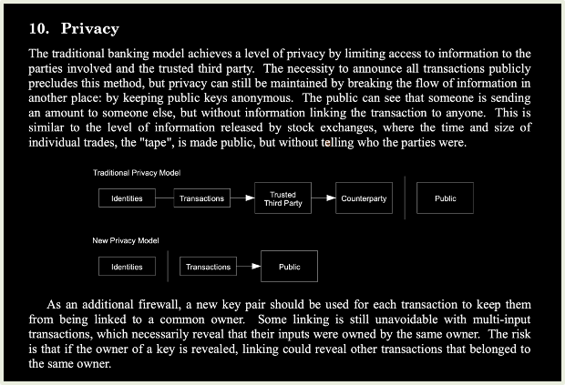
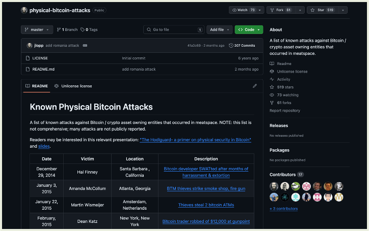
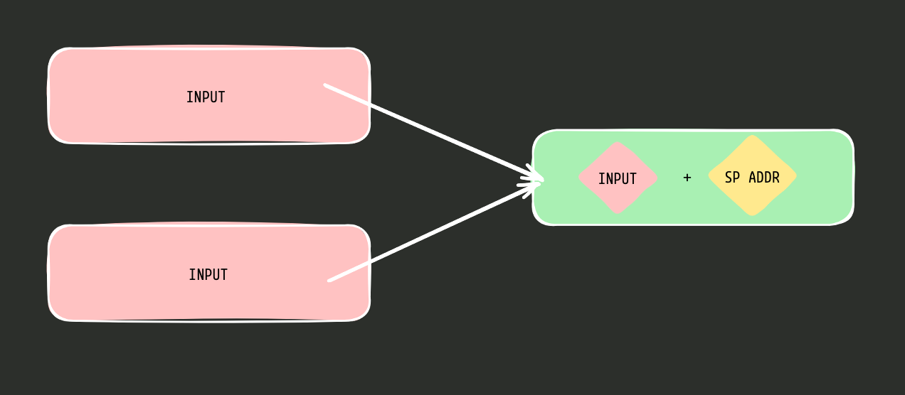

# Cypherpunks Write Code

> The strongest force against tyranny is a libertarian who can code.

We have all heard several discussions as to why Bitcoin is sound money. They mostly involve Austrian Economics, Bitcoin's fixed money supply and decentralised ledger. But Bitcoin as the currency of the dark net is rarely discussed. It is often just shrugged away as yes criminals will use them, but it shouldnt be regulated. Do Bitcoin developers need to build technolgy to help those breaking the law?

All of us will have varying opinions as to what should and shouldnt be done by the government. Even among libertarians there is a vast spectrum of opinions as to what should come as collective decisions and what is individual responsibilty. A criminal is someone who commits a crime and when even the act of saving for the future becomes classified as a crime, shouldnt the we developers build to help the criminals?

Gold was, for many many centuries up until 1933, a typically “uncorrelated financial asset with some disinflationary features” that people in the United States and elsewhere could invest in. But then came Executive Order 6102. Gold was confiscated all across the nation, and all the investors who didn’t protect their privacy (which was especially hard with “paper gold,” kept in custody by trusted third parties eager to comply with the order, but also pretty hard with actual physical gold, difficult to hide in large amounts or to smuggle across a border) had to give it to the government.

## Poor Privacy in Bitcoin

> It doesn’t matter which protocol you use: If the tools are inadequate, so is your privacy.

Satoshi himself has discussed that privacy is not a given in an open public ledger such as the bitcoin blockchain. Address reuse, KYC and online seed phrase backup is almost ubiquitous in other cryptocurrencies. Infact it is common for address reuse between different assets and sometimes even the between main chain and side chains. Bitcoiners are among the most privacy conscious individuals and Bitcoin tech and education has been built so that privacy is in its center.

But the Bitcoin ecosystem is not perfect.

- Most of Bitcoin is still held in exchanges.
- Even if they leave the exchanges they are KYCed
- Even though there is no address reuse, the storage and privacy of xpubs are not done well. While using light clients these can be exposed to upstream servers.
- Deposit and withdrawal addresses are static in exchanges and this can be correlated easily with the exchange
- Making donations to entities without regime support are politically risky
- Chain analysis is still possible to predict the owners of coins with high proability (enough to convict users in legal systems)

## Why we need Privacy anyway?

The arguments for privacy in Bitcoin can be broadly split into 3 -

### Bitcoin was designed for privacy

As evident from the whitepaper, Satoshi Nakamoto and the other cypherpunk creators of Bitcoin wanted it to be a network for anonyomous or atleast pseudonymous transactions. We cannot rely on the buyers or merchants to respects privacy, as that would go against the freedom of speech. The only way to maintain privacy is by revealing as less information as possible, which would mean that the payment method itself should never contain personal data. This is only possible with a monetary network thats completely separate from the real world identities.

### Privacy is good for the individual

Although the list of physical attacks for bitcoin isnt a long list its a significant list. As the price increases it becomes more and more profitable to violently take someone's key than to earn it. This is why Deniabilty is crucial for a private network. This is more true for political rent-seekers (tax, excise, bribes, etc), since its more efficient to rob known high net worth individuals from their KYC list than to monitor and tax normal everyday simple transactions. To maintain this deniabilty it is paramount for the users to detach their personal identities from their transactions.

### Privacy is good for the entire network

The possibility for an individual receiving a monetary tool to safely ignore any connection between that tool and any particular individual or use case it interacted with in the past can be termed as fungibility. Any random amount should be indistinguishable from any other. This is important for the verification cost as if a merchant or individual had to verify the entire chain against a blacklist it would mean very expensive transactions.

Non-fungible goods cannot work as money. This is a major threat due to the current (almost ubiquitous) KYC regulations around the world. Idealogy apart, functionally a monetary good cannot exist if every hand it passed through had to verify the political status of every previous hand to accurately gauge that amount's political risk. Although there are other attacks on Bitcoin's fungibilty (ordinals), erosion of privacy is the one with most damning potential.

## Silent Payments

> ... fiat-to-bitcoin bridges will almost always end up demanding a scary amount of personal information from their user, linking that information to a few deposit and withdrawal addresses (often incentivizing continuous reuse).

Silent payments is a new approach to reusable payment codes, which remove the need for a notification transaction entirely by leveraging the outputs in a transaction to signal to the recipient when funds are intended for them. This can make address sharing easier with a static SP(silent payments) address, that transforms to different addresses for each payment. It will not need complex XPUB management tools, to permenantly stop address reuse. Also it can make chain analysis very difficult by never revealing who the receiver is, even if the receiver's SP address is publicly known. The main limitations to SP is the large compute needed to scan if we have received a new payment or not but this is a technical problem and can be optimized.

Privacy tech such as SP, coin swap, coin join, pay join to name a few are crucial to maintaining privacy in Bitcoin's ecosystem and hence due to the above mentioned 3 reasons, the success of bitcoin itself.

## Cypherpunk and Crypto-anarchism

> We the Cypherpunks are dedicated to building anonymous systems. We are defending our privacy with cryptography, with anonymous mail forwarding systems, with digital signatures, and with electronic money.

We all cheer as ETFs get approved and companies and nation states start stacking bitcoin. But day by the KYC requirements for transactions are getting stricter and developers like Ross Ulbricht, Roman Sterlingov et al are jailed for the simple act of writing code. Yes Bitcoin is sound money but it cannot remain to be money if it isnt private, and so working towards Bitcoin privacy should be every Cypherpunk's goal. We Cypherpunks Write Code!

### Acknowledgements

- [A Treatise on Bitcoin and Privacy by Giacomo Zucco](https://www.giacomozucco.com/a-treatise-on-bitcoin-and-privacy/)

- [Cypherpunk Manifesto](https://www.activism.net/cypherpunk/manifesto.html)

- [Silent Payments BIP Pull Request](https://github.com/bitcoin/bips/pull/1458)
